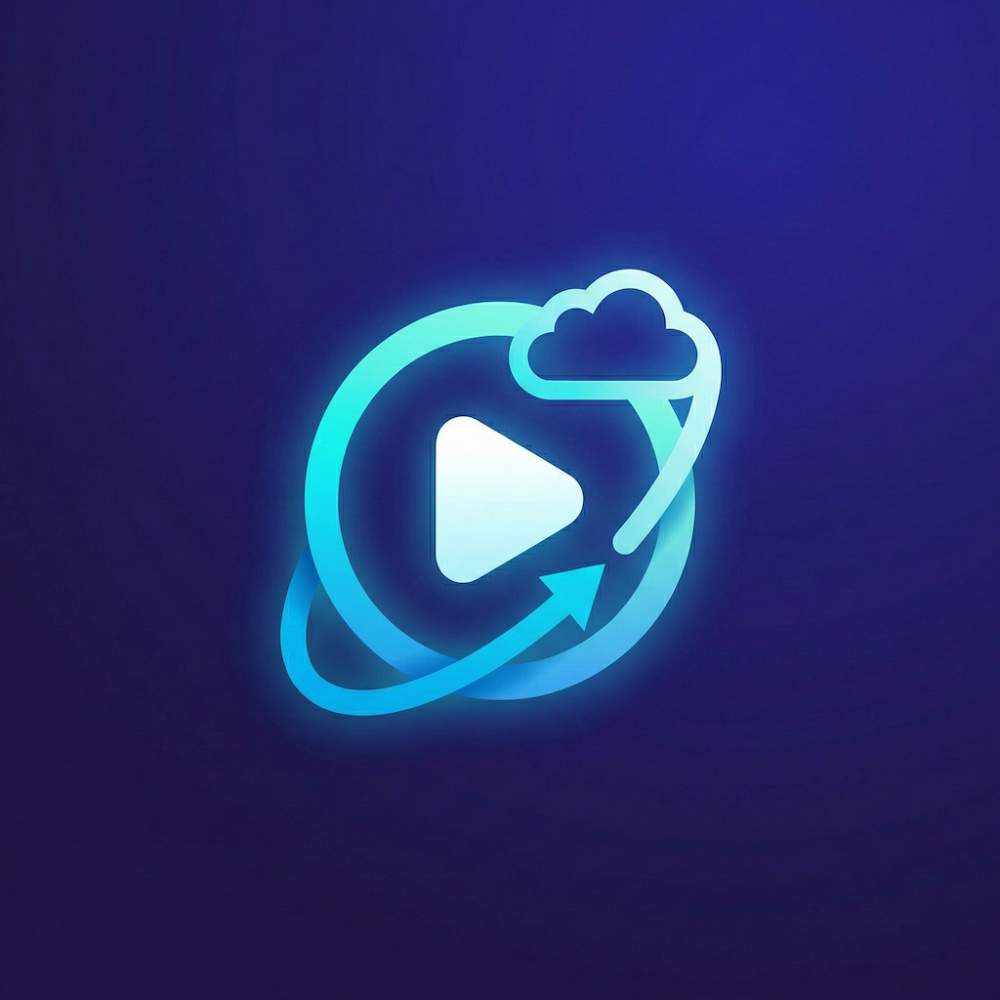

# YourPods

**Privacy-first, self-hosted podcast player for iOS, macOS, and Apple Watch.**

[Feature Highlights](#feature-highlights) • [Installation](#installation) • [Technical Details](#technical) • [Contributing](#getting-started-for-developers)

---

> [!IMPORTANT]
> **YourPods 26.8.0 — Latest Release**
>
> YourPods is built natively in **Swift and SwiftUI**.
>
> Versions now follow a calendar scheme — `yy.mm.vv`, for the year, the month, and the release's index within that month. 26.8.0 is what 2.0.5 would have been.
>
> **gPodder and Nextcloud sync are subscription-free — and always will be.** So is local Vault Mode. Everything YourPods does with your own server is free, in this release and in every release after it.

YourPods is a gPodder-compatible [Nextcloud-gpodder](https://github.com/thrillfall/nextcloud-gpodder) or [Nextcloud-Nextpod](https://github.com/pbek/nextcloud-nextpod), privacy-first, and self-hosted podcast player. Sync your subscriptions and listening progress across all your devices using your own Nextcloud server, manage multiple profiles, and keep your data 100% yours. Check out [Repod](https://git.crystalyx.net/Xefir/repod/) for podcast listening via your Nextcloud install.

   
  
   
   

## Installation

The current codebase corresponds to the 26.8.0 release in the [Apple App Store](https://apps.apple.com/us/app/yourpods/id6757721236).

- **App Store**: Get automatic updates and hassle-free installation. Purchasing the App Store version directly funds YourPods development! 🙏
- **TestFlight**: Join the [TestFlight Beta](https://testflight.apple.com/join/jF18YknW) to test new features for free.
- **Source**: Build it yourself from this repository using the [developer instructions](#getting-started-for-developers).

For the most up-to-date features, check our [website](https://yourpods.app).

## Feature Highlights

YourPods seamlessly integrates with gPodder-compatible servers (such as Nextcloud & NextPod) to keep your library in sync without relying on third-party clouds.

### What's New in 26.8.0

#### 📝 Episode Notes
- **Timestamped notes on any moment** — from the player, the mini player, or episode detail, with colours and comma-separated tags. Browse them all from the Notes button in the Library, grouped by episode and filterable by tag.
- **Anchored to chapters and transcripts** — long-press a chapter or a transcript line and choose Add Note; the note keeps the chapter title or the quoted line as context.
- **Export anywhere** — a single Markdown file with YAML frontmatter, an **Obsidian** vault (per-episode note, daily-note append, or share sheet), or your own **Nextcloud** as Markdown files or real Nextcloud Notes.
- Notes and every export path are **free for everyone** — no account required.

#### 🎧 Chapters from the Audio File
- **Embedded chapters** — ID3 chapters in MP3 and chapter atoms in MP4/M4A, preferred over feed chapters because they stay aligned with the audio actually playing, including after dynamic ad insertion.
- **Chapter artwork** follows playback on the full player, mini player, lock screen, Control Center, and CarPlay, with thumbnails in the chapter list.
- **One chapter list everywhere** — resolved once per episode and shared by every screen, CarPlay, and Siri, and loaded at launch for a restored episode.

#### 📱 Now Playing Widget
- **Home Screen widget in three sizes** — artwork, episode and show title, and a progress bar with a live-counting elapsed time. Medium and large add play/pause and skip controls; large lists the next four episodes in Up Next.

#### 🌍 Five New Languages
- **German, Spanish, French, Italian, and Dutch** alongside English — over 1,080 strings in each, covering the app, the Apple Watch app, widgets, the Live Activity, the complication, Siri phrases and replies, and VoiceOver.
- Plural rules and duration formatting follow each language ("1 Folge" / "12 Folgen", "2 Std. 30 Min.").
- Translations are AI-assisted; the app says so once per language and links to support for corrections.

#### 🛡️ P3 Privacy Mode
- **39 tracking prefixes across 25 analytics services**, up from 31 hardcoded patterns — a bundled snapshot of the OPAWG public prefix registry plus a curated supplement.
- **Matched by host, not by path** — a tracker changing its URL shape no longer defeats P3, and `awCollectionId` / `awEpisodeId` are stripped alongside `utm_*` while signed playback parameters are left alone.
- **Dynamic ad-insertion URLs are now passed through untouched** — Megaphone and AdsWizz serve the audio themselves, so there is no inner URL to reveal. P3 is a privacy tool, not an ad blocker.

#### 🔗 Share Links
- **Share an episode, a show, or the exact second you're listening to** as a `share.yourpods.app` link, minted with Apple device attestation — no account required, with a plain-text fallback if the link can't be created.
- **Opening one** takes you to the episode if you follow the show, or to a preview sheet with Play, Play from the shared timestamp, Add to Queue, and Follow Show if you don't.

#### 🗣️ Siri & Shortcuts
- **32 Shortcuts actions, up from 13** — chapters, downloads, bookmarks, share links, queue control, and stats. Ten carry "Hey Siri" voice phrases (Apple's cap).
- **Actions that return values** — Get Current Episode, Get Queue, Get Podcasts, What's Next, Get Listening Stats, Get Share Link.
- **Siri answers with real data** — every command runs the real action and waits for it, so controls work from a suspended app and "What's playing?" names the episode.

#### ⌚ Apple Watch
- **Sleep timer, playback speed, and your iPhone's skip intervals** on the watch player, plus the system Now Playing page.
- **Complications finally show what's playing** — nothing ever wrote that data before, so they were always empty.
- **Library browsing and background refresh, both broken, now work**, and progress from the watch survives an unreachable iPhone instead of being dropped.

#### 🔄 Sync You Can Trust
- **Per-episode version checks** so two devices can't quietly overwrite each other's position.
- **A durable outbox for Mark as Played** that retries until the server confirms it — a dropped connection or a background kill no longer loses it.
- **Conflict resolutions that stick**, with a clearer sheet that names each side, saves your choice, and reads correctly under VoiceOver.
- **Positions stay in their profile** — switching between a gPodder server and a YourPods account can't cross-contaminate either.

#### 🆕 Also New in 26.8.0
- **Liquid Glass on iOS 26** with a Glass Style setting (Classic, Clear, Glass, High Contrast); Reduce Transparency and Increase Contrast override it automatically.
- **Library Episodes view and episode search** — one flat episode list across every show, and search across episode titles and descriptions.
- **Episode swipe actions** — assign Add to Queue, Play Next, Mark as Played, Hide, or Play Now to each direction.
- **Auto-hide unplayed episodes** older than 7–90 days, with a per-podcast override and Undo All for 30 days.
- **Transcript search** with match navigation, plus Markdown and RTF transcript support.
- **Sign in with Nextcloud** — browser-based Login Flow v2 with one-tap re-authentication.
- **AirPlay picker in the mini player**, **pause on headphone disconnect**, and **Control Center media suggestions**.
- **Requires iOS 18** — macOS 14 and watchOS 10 unchanged.

See [RELEASE_NOTES.md](RELEASE_NOTES.md) for the full list.

---

### What's New in 2.0.4

#### 🛡️ P3 Privacy Mode
- **Privacy Preserving Playback** — blocks tracking domains from episode URLs before playback. Enable globally or per-podcast. Green shield icon on Now Playing when active.

#### 🔔 New Episode Notifications
- **Local push notifications** when background refresh discovers new episodes. Per-podcast controls. Stale episode delivery ensures you never miss an update. 100% local — no push servers.

#### 🙈 Hidden Episodes & Clear Queue
- **Hidden Episodes** — declutter your feed without affecting listening stats. Batch-hide old episodes. Hidden state syncs across devices.
- **Clear Queue** — one-tap clear from the Up Next overflow menu.

#### ⚡ Performance & Reliability
- **6× faster feed refresh** with concurrent fetching and real-time progress display.
- **95% reduction in disk I/O** during playback — progress, action map, and queue persistence all throttled and batched.
- **Incremental sync** — only fetches changes since your last sync, not the entire history.
- **Background sync fixed** — the toggle, interval, and re-scheduling all work reliably now.
- Eliminated audio engine data races with compile-time MainActor isolation.
- 50+ additional sync, stability, and crash fixes.

#### 🆕 Also New in 2.0.4
- **Episode Activity** — chronological played-episode list with progress, timestamp, and device.
- **App Icon Badge** — unplayed episode count on the app icon.
- **Custom gpodder.net server address** — point at your own gpodder.net-compatible instance.
- **Download from any context menu** — long-press episodes anywhere to download.
- **watchOS: Recently Updated** — 10 most recent unplayed episodes on your wrist.

---

### What's New in 2.0.3

#### 📁 Podcast Groups
- **Named folders** — organize your library into groups like "Tech" or "Comedy". Bulk-move shows and browse groups in CarPlay.

#### ♿ VoiceOver Excellence
- Comprehensive VoiceOver support across the entire app — custom rotor actions, adjustable seek bars, and descriptive labels on every control.

#### ⌚ Watch Background Audio
- True background playback on Apple Watch — navigate freely while listening, with automatic episode auto-advance on your wrist.

#### 🆕 Also New in 2.0.3
- **Enriched OPML export** preserves custom groups and Listening Profiles.
- **Smarter chapters** — expanded timestamp format recognition from show notes.
- **Redesigned Now Playing card** with larger artwork and clearer chapter display.
- **Download network setting** — Wi-Fi Only, Cellular Only, or both.
- **Vault to Sync upgrade** — migrate a local Vault Mode library to a gPodder server without losing subscriptions.
- **Streamlined onboarding** — new welcome flow for Vault Mode and gPodder Sync.

---

### What's New in 2.0

#### 🚀 Complete Native Rewrite
- **100% Swift and SwiftUI** — fully native app with fast launch times, smooth animations, and low memory usage.
- **SwiftData** for local storage — Modern, Apple-native persistence layer.

---

#### 🚗 CarPlay Enhancements
- **Recently Updated tab** — browse new, unplayed episodes directly from CarPlay without reaching for your phone.
- **Chapter navigation** — skip between chapters using dedicated Prev/Next Chapter buttons on the Now Playing screen.
- **Speed & silence controls** — adjust playback speed and toggle trim-silence directly from CarPlay.
- **Artwork placeholders** — podcast and episode artwork always displays immediately with a placeholder while full artwork loads.

---

#### 🗣️ Siri & App Intents
- **10 native Siri commands** — play, pause, stop, resume, skip forward/backward, next episode, play latest, play a specific podcast, and set playback speed — all hands-free.
- **Shortcuts integration** — all intents work as Shortcuts and can be added to automations.

---

#### ⏱️ Per-Podcast Settings
- **Auto-queue mode** (off / normal / priority), **auto-download**, **remove after playing**, and **archive on complete** — configurable per podcast and as global defaults for new subscriptions.

---

#### 🔐 Account & Sync
- **Profile deletion** — fully delete profiles and all associated data.
- **Per-profile sync timestamps** — switching profiles no longer causes stale syncs.
- **Episode Activity view** — inspect recent sync actions in Settings.

---

#### ⌚ Apple Watch
- **Standalone playback** with offline episode transfer.
- **Watch complications** showing playback status.
- **Configurable sync** — choose how many podcasts sync to the watch.

---

#### 🎵 Playback
- **Native AVAudioEngine** — rebuilt audio pipeline for Bluetooth reliability, Siri interruption recovery, and background auto-advance.
- **Sleep timer** with configurable durations.
- **Skip intro/outro** with per-second precision (0–120s).

---

### Carried Forward from 1.x

- **Cross-Device Sync** via gPodder server — subscriptions, listening positions, played state, and hidden episodes (the gPodder protocol doesn't carry a queue, so Up Next stays per-device on a self-hosted server)
- **OPML Import & Export** for subscription migration
- **Password-Protected Feeds** (Patreon, premium feeds) — credentials stored securely on-device
- **Local Accounts** — no server required
- **Live Transcripts** — interactive, searchable, auto-scrolling
- **Smart Chapters** — embedded ID3/MP4 chapters, Podcasting 2.0, RSS, and description-parsed
- **P3 Privacy Mode** — tracker stripping before playback
- **Podcast Groups** — named folders with CarPlay browsing
- **Hidden Episodes** — declutter feeds without affecting stats
- **New Episode Notifications** — local push alerts
- **Dynamic Island & Live Activities** on supported iPhones
- **Listening Stats** dashboard
- **Background Refresh** with configurable intervals
- **Unified Search** — iTunes or PodcastIndex
- **Appearance** — system, light, or dark theme; configurable tab bar style and start page

## A Note on YourPods Cloud

YourPods also offers an optional hosted account for people who don't want to run a server. **YourPods Free Sync** is free and keeps subscriptions and listening positions in sync. **YourPods Pro** is a paid tier that adds a web player, cross-device Up Next handoff, and notes sync — pricing lives on the App Store listing.

That is a separate, optional product. **gPodder, Nextcloud, and Vault Mode are complete, free, and always will be**, and episode notes, notes export to Markdown/Obsidian/Nextcloud, P3, transcripts, chapters, CarPlay, and the Apple Watch app all work with no YourPods account at all. The Firebase and RevenueCat dependencies below exist solely to authenticate and entitle that optional account; nothing on the self-hosted path touches them.

## Getting Started for Developers

1.  **Prerequisites**: Xcode 26+ and [XcodeGen](https://github.com/yonaskolb/XcodeGen) (`brew install xcodegen`).
2.  **Clone**: `git clone https://github.com/asecretcompany/yourpods-source.git`
3.  **Generate project**: `xcodegen generate`
4.  **Open**: `open YourPods.xcodeproj`
5.  **Run**: Select the `YourPods` scheme and build for an iOS Simulator or device.

> [!NOTE]
> The project uses `project.yml` (XcodeGen) to generate the Xcode project. Do not edit `YourPods.xcodeproj` directly — make changes in `project.yml` and re-run `xcodegen generate`.

Credentials in this repository are placeholders (`YOUR_API_KEY`, `YOUR_TEAM_ID`,
`YOUR_REVENUECAT_API_KEY`) and **you don't need to replace them**. Local playback, gPodder
sync, Nextcloud sync and Vault Mode all work as-is — the app detects the placeholders and
skips Firebase rather than failing. Only the optional hosted account needs real credentials.
See [CONTRIBUTING.md](CONTRIBUTING.md) for details and for running the test plans.

## Technical

| | |
|---|---|
| **Language** | Swift 5.10 |
| **UI** | SwiftUI |
| **Storage** | SwiftData |
| **Audio** | AVFoundation / AVAudioEngine |
| **Sync** | gPodder-compatible (Nextcloud gpodder-sync), with Nextcloud Login Flow v2 for browser sign-in. Optional YourPods Cloud backend |
| **Localization** | String Catalogs — English source, translated to de, es, fr, it, nl |
| **Minimum Targets** | iOS 18.0, macOS 14.0, watchOS 10.0 |
| **Build System** | XcodeGen (`project.yml`) + Swift Package Manager |
| **Dependencies** | Firebase (Auth + App Check), RevenueCat — optional YourPods Cloud account only |

### Architecture

- `YourPods/YourPods/Audio/` — Audio playback engine (AVAudioEngine-based)
- `YourPods/YourPods/Models/` — SwiftData models (Podcast, Episode, ServerProfile, Annotation, etc.)
- `YourPods/YourPods/Networking/` — gPodder API client, RSS parser, URL resolver, P3 tracker stripper
- `YourPods/YourPods/Networking/Resources/` — Bundled OPAWG tracker-prefix snapshot + curated supplement
- `YourPods/YourPods/Services/` — CarPlay, Live Activities, Transcripts, Watch, Downloads, Background Refresh, Listening Stats, OPML, notes export, share links
- `YourPods/YourPods/Services/Chapters/` — Embedded ID3 and MP4 chapter extraction, chapter artwork
- `YourPods/YourPods/Services/Intents/` — App Intents, entities, and the Siri handler
- `YourPods/YourPods/Services/Sync/` — Sync orchestrators, playback reconciler, baseline store
- `YourPods/YourPods/State/` — State managers (Player, Podcast, Settings, Navigation, Sleep Timer)
- `YourPods/YourPods/Views/` — SwiftUI views and reusable components
- `YourPods/YourPods/Utilities/`, `YourPods/YourPods/Utils/` — Shared helpers and extensions
- `YourPodsWatch/` — watchOS app with standalone playback
- `YourPodsWidgets/` — Now Playing widget, Live Activities, and Lock Screen widgets
- `YourPodsComplication/` — watchOS complications
- `YourPodsTests/` — Unit tests

## License

This project is licensed under the [GNU General Public License v3.0](LICENSE).

A small number of bundled files come from elsewhere and keep their own terms — the OPAWG
tracker prefix list (MIT) and the Auphonic chapter test fixtures (CC BY 3.0 AT). They are
credited in full in [NOTICE.md](NOTICE.md).

## Trademark Policy

"YourPods", the YourPods logo, and the YourPods design are trademarks of A Secret Company, LLC. You may modify and redistribute this software under the terms of the GNU General Public License v3.0, but you may **not** use the "YourPods" name, logo, or assets in any derivative works, modified versions, or commercial products without explicit written permission.

If you fork this project or build it for public distribution, you **must** remove all references to "YourPods" and replace the logo with your own. This ensures that users do not confuse your version with the official release.
